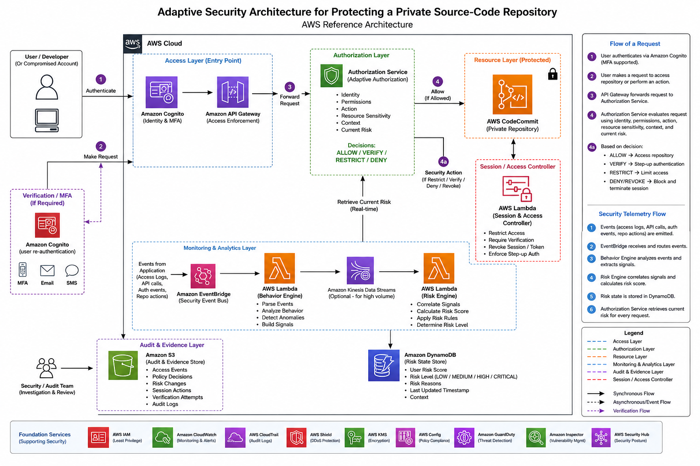

# Adaptive Security Architecture for a Private Source-Code Repository

An AWS reference architecture that protects a private source-code repository against the case where a legitimate developer's credentials or session have been compromised.

*(Replace `diagram.png` with your architecture diagram, committed to the repo root.)*

## Problem being solved

Traditional authentication answers "Who are you?" and authorization answers "What are you allowed to access?" The gap: a stolen but valid credential lets an attacker look exactly like the legitimate user to both checks.

**Example:** A developer normally works on Project A. An attacker steals their valid session and can now authenticate successfully, enumerate other repositories, access Project B, read sensitive configuration, or download large amounts of source code — all while appearing as a trusted identity.

This architecture adds a third question on top of the usual two: **"Given the user's current behavior and context, should this specific action be allowed right now?"**

## Security model

`Authenticate → Authorize → Monitor → Analyze Behavior → Calculate Risk → Adapt Access → Audit`

| Stage | Purpose |
|---|---|
| Least Privilege | Limit what each identity can access before an attack even occurs |
| Authentication | Verify the identity/session (Amazon Cognito, with MFA/step-up) |
| Authorization | Check permissions for the requested action and resource |
| Behavior Monitoring | Observe access patterns, downloads, repository actions, and context |
| Risk Evaluation | Determine how suspicious the current activity is |
| Adaptive Access | Change the effective decision based on current risk |
| Session Control | Restrict, require verification, or revoke access |
| Audit / Evidence | Preserve security events and decisions for investigation |

## Architecture components

- **Amazon Cognito** — identity, authentication, MFA/step-up authentication
- **Amazon API Gateway** — controlled entry point and access-enforcement boundary
- **Authorization Service** (custom) — evaluates identity, permissions, action, resource sensitivity, context, and current risk
- **AWS CodeCommit / private Git repo** — the protected resource
- **Amazon EventBridge** — routes security and application events to downstream analysis
- **AWS Lambda (Behavior Engine)** — processes events, detects unusual patterns, builds behavioral signals
- **AWS Lambda (Risk Engine)** — combines signals into a current risk score/state
- **Amazon DynamoDB** — stores the current risk state so authorization decisions use fresh, centralized data
- **Session/Access Controller** — executes restrict, verify, revoke, or step-up actions
- **Amazon S3** — stores audit and security evidence (access events, policy decisions, session actions)

**Supporting foundation services:** IAM (least privilege), CloudWatch (monitoring/alerts), CloudTrail (audit logs), Shield (DDoS protection), KMS (encryption), Config (policy compliance), GuardDuty (threat detection), Inspector (vulnerability management), Security Hub (security posture).

## Request flows

**Normal flow:** Developer authenticates via Cognito → requests an action → API Gateway enforces the entry boundary → Authorization Service checks permissions, resource sensitivity, and current risk state → if allowed, request proceeds to the repository → the action emits telemetry for monitoring.

**Suspicious flow:** An attacker uses a stolen but valid session → unusual behavior occurs (rapid file access, repository enumeration, sensitive downloads) → events flow through EventBridge → the Behavior Engine compares activity against the user's baseline and extracts signals → the Risk Engine calculates a risk state (LOW/MEDIUM/HIGH/CRITICAL) → the next sensitive request is evaluated against that state → the system can ALLOW, RESTRICT, VERIFY, DENY, or REVOKE.

## Example attack scenario

An attacker with a stolen valid session requests a download of a sensitive security configuration file. Authentication succeeds (valid session) and the identity normally has repository access — but the resource is high-sensitivity and recent behavior has already raised the risk score to HIGH. The policy decision is **VERIFY rather than allow immediately**; failing verification restricts or revokes the session and logs the event. This shows why user risk, resource sensitivity, and current behavior all have to factor into the same decision — none of them alone is sufficient.

## Key design principles

- **Authentication is not permanent trust** — a user can stay logged in while their effective access shrinks as their behavior becomes risky.
- **Risk is multi-dimensional**, not a single threshold (e.g. "over 100 files = attack"). Device, location, time, resource sensitivity, and sequence of actions all combine into the score.
- **User risk and resource sensitivity are separate axes** — a low-risk user touching a highly sensitive credential is not the same as a low-risk user reading an ordinary file.
- **Synchronous vs. asynchronous separation** — the access-decision path (auth → gateway → authorization → repo) stays fast; the expensive behavior/risk analysis runs asynchronously off the request path via EventBridge, so normal requests are never slowed down by it.
- **Defense in depth** — least privilege, authentication, API boundary, authorization, behavior monitoring, risk evaluation, adaptive authorization, session control, and audit evidence are independent layers; no single layer is expected to stop every compromise.
- **Controlled baseline learning** — behavioral baselines update with confidence and validation, so an attacker can't gradually "poison" what looks normal.

## Failure considerations

- **Risk Engine unavailable:** should not fail open for highly sensitive actions — fallback behavior is defined per resource sensitivity.
- **Slow exfiltration:** detection can't rely on volume thresholds alone; sequence, timing, and resource sensitivity matter too.
- **Stolen valid JWT:** a valid token proves authentication, not unrestricted authorization.

## Expected outcome

The architecture doesn't claim credentials can never be stolen — it reduces the **blast radius** of a compromised identity. A stolen session doesn't automatically grant unrestricted repository access, and suspicious behavior makes the system progressively more defensive.

## Scope note

The AWS services here are implementation building blocks. The adaptive-security behavior itself — the Authorization Service, Behavior Engine, Risk Engine, and Session/Access Controller — is application-level security logic that has to be designed and implemented; it isn't a feature a single AWS service provides automatically.

## Tech stack

Amazon Cognito, API Gateway, EventBridge, AWS Lambda, DynamoDB, S3, CodeCommit, IAM, CloudWatch, CloudTrail, AWS Shield, KMS, AWS Config, GuardDuty, Inspector, Security Hub.
